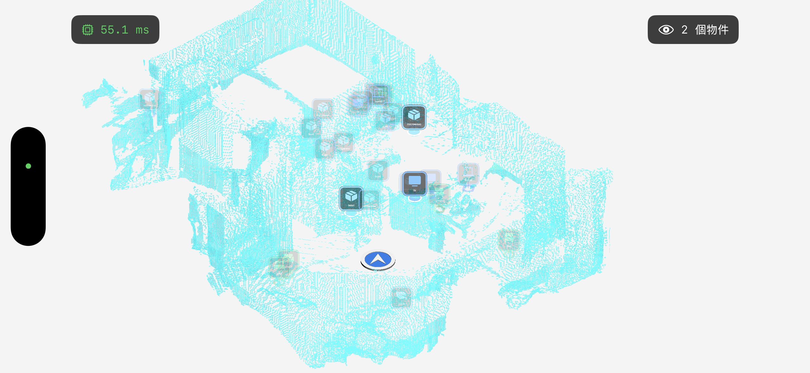
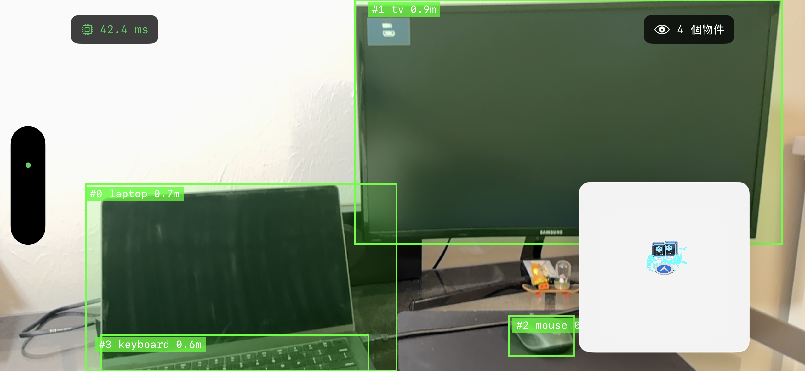
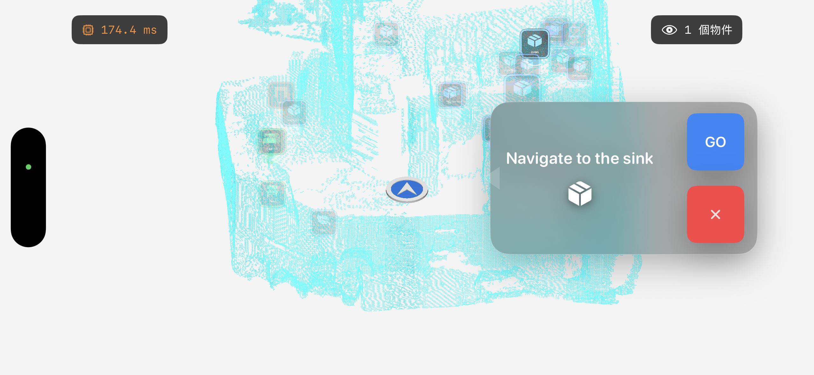

# Inception — AR Navigation Prototype

> Built an on-device AR navigation system that performs real-time object detection, reconstructs the environment with ARKit, and generates navigable paths using A* — all without a backend.

---

## 📸 Demo

---

## 🚀 Highlights

- Real-time **object detection + 3D localization** using ARKit depth  
- Converts detections into **metric world-space positions**  
- Builds a **navigation map from AR mesh reconstruction**  
- Computes routes using **A* pathfinding**  
- Maintains **persistent landmarks**  
- Fully **on-device pipeline**  

---

## 🧱 Tech Stack

- **SwiftUI**
- **ARKit (LiDAR, Scene Depth, Mesh Reconstruction)**
- **MetalKit + SceneKit**
- **ONNX Runtime (Core ML Execution Provider)**
- **A\* Pathfinding**

---

## ⚙️ Key Features

### Depth-aware Object Detection
- On-device inference  
- 2D → 3D world coordinate projection  

### Persistent Landmark System
- Filters dynamic objects  
- Merges detections into stable landmarks  

### AR Mesh Navigation
- Mesh → occupancy grid  
- Walkable vs obstacle classification  

### Real-time Pathfinding
- A* pathfinding  
- Continuous route updates  

---

## 🗺 Visualization

### Minimap

### Detection

### Navigation

---

## 🎥 Demo Video

---

## 💡 Why This Project

- Combines **AR + Computer Vision + Navigation**
- Real-time **on-device system design**
- 2D perception → 3D understanding → navigation

---

## 📚 References

- https://developer.apple.com/augmented-reality/arkit/  
- https://onnxruntime.ai/  
- https://theory.stanford.edu/~amitp/GameProgramming/AStarComparison.html  

---

## 🧾 Summary

A real-time AR system that detects objects, understands space, and navigates users — entirely on-device.

## 📬 Contact

Feel free to reach out if you'd like to learn more about this project or discuss opportunities.

- Email: hongyulin715@gmail.com   
- LinkedIn: https://www.linkedin.com/in/hongyu-lin-06a244185/
